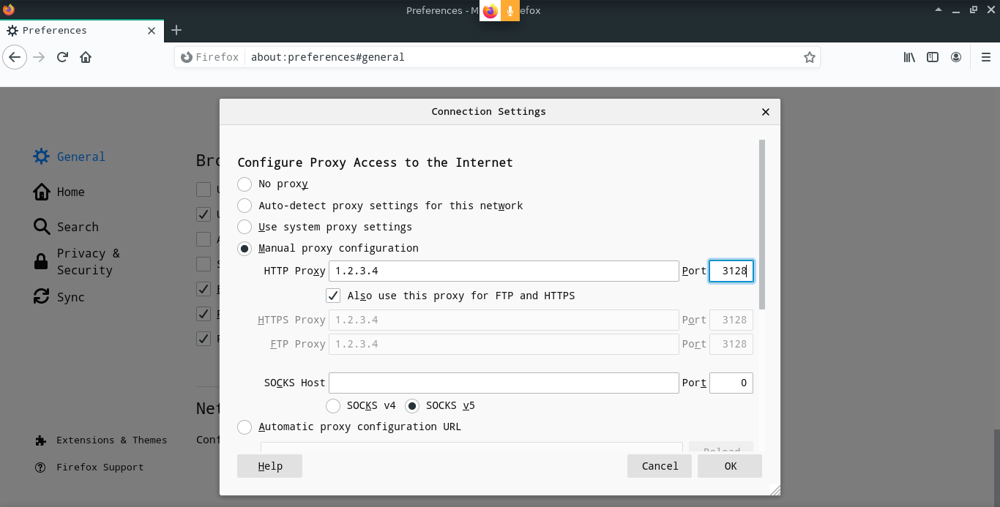
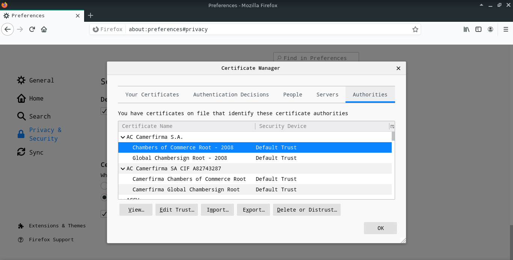
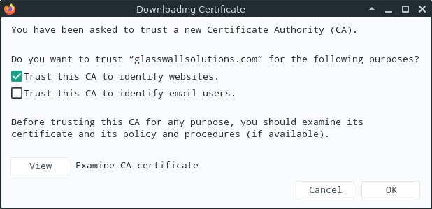
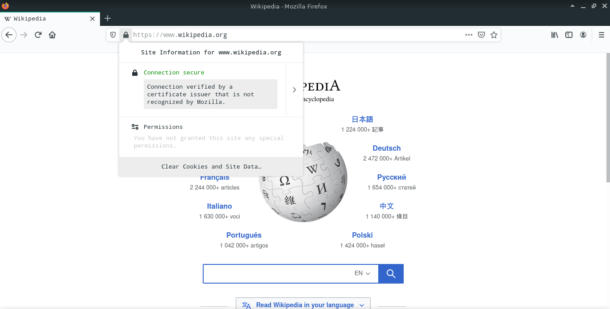

# Explicit client side configuration

You can use firefox to test proxy connectivity, we have to configure both proxy and X.509 certificate authorities

## Firefox connection configuration

After deploying the proxy server using ansible playbook, you should see the Cloud VM IP address in playbook output, use it to configure your client (i.e: firefox):

From the right side of the address bar, click the 3 bars button **> Options > General > Network > Connection Settings** , then choose **Manual proxy configuration** then configure it as follows.



Use the VM IP address in place of the example IP address  `1.2.3.4` , if you didn't change the proxy port in `config_vars.yaml` , you should use port `3128 TCP` which is the default option, you will need to check `Also use this proxy for FTP and HTTPS` , 

## Firefox CA configuration

Copy the certificate authority part from `squid.pem` to a new file and import it into firefox, you can do it quickly with

```bash
sed -n '/BEGIN CERT/,/END/p' squid.pem > squid-ca-only.pem
```

To import the newly created file `squid-ca-only.pem` to firefox by , click the 3 bars button from the right side of the address bar **> Options > Security & Privacy > Certificates > View Certificates** , then choose **Import** in the **Authorities** tab.



After choosing the recently created CA file, Check **Trust this CA to identify websites** then click **OK**



You can now go through the proxy to any HTTP or HTTPS websites to test connectivity

To make sure that https is correctly working, you can visit [an https site](https://www.wikipedia.org) and check the issuer from the green padlock button then click the right arrow, firefox shows a warning that you can safely ignore that the CA isn't recognized by Mozilla.




You can also use [this website](https://ipinfo.io/ip) to make sure you are connecting through the proxy, it should show the VM IP address if everything is correctly configured.
