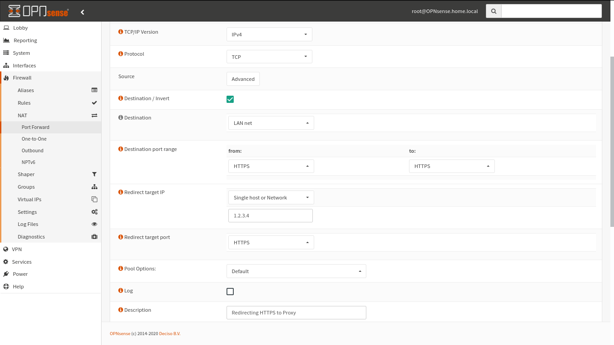

# Transparent proxy client side configuration

After deploying the proxy server using ansible playbook, you should see the Cloud VM IP address in playbook output, use it to redirect traffic with . To route a network HTTP and HTTPS traffic through proxy, without having to configure proxy on clients devices you must redirect traffic with destination port `80/tcp` to the proxy transparent http port sepcified in `config_vars.yaml`  as `squid_transparent_http_port`  which is `3129/tcp` by default , and traffic with destination port `443/tcp` to to the proxy transparent https port sepcified in `config_vars.yaml` as `squid_transparent_https_port` wich is `3130/tcp by default` .

Usually, similar actions are accomplished with a firewall appliance.

Below, you can find a diagram illustrating end-to-end network topology


## Configuring firewall to redirect traffic to transparent proxy, OPNsense as an example

OPNsense is a free and open source FreeBSD based firewall distribution, you can use it to redirect traffic to the proxy if the firewall is used as a NAT enabled router.

### Port forward configuration

Login to OPNsense using an administrator user, from the left side bar choose **Firewall > Nat > Port Forward** then from the top right, click **+ Add** to add a new rule

You can specify rule source host or subnet by click **Advanced** button in Source field and fill the desired source host or subnet.


Specify **Interface** as the internet facing network interface, **TCP/IP version** as IPv4, and **Protocol** as TCP

You can choose any destination network to apply the rule on, I enabled **Destination / Invert** and chose **Destination** as LAN interface net to apply the rule on any non-LAN host.

Set destination port range From and To as **HTTP**,  and set Redirect traget IP and Port to match the Proxy address and HTTP transparent port. and click save


Create a new rule with the same configuration (or use **Clone** button in rules list page) and change destination port range From and To to **HTTPS**, and set Redirect traget IP and Port to match the Proxy address and HTTPS transparent port, and click save



You should be able to see a similar rule list, to finalize, click **Apply changes button**


### Certificate authority file preparation

Copy the certificate authority part from `squid.pem` to a new file and import it into firefox, you can do it quickly within a linux environment by executing:

```bash
sed -n '/BEGIN CERT/,/END/p' squid.pem > squid-ca-only.pem
```

Transfer recently created file `squid-ca-only.pem` to source hosts affected by the rule created, or upload it to a server where they can download the file.
