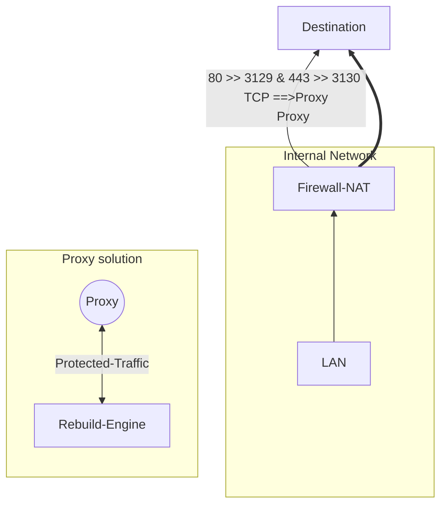

```mermaid
flowchart BT

    subgraph Internal Network
    LAN-->Firewall-NAT
    end

    subgraph Proxy solution
    Proxy((Proxy))<--Protected-Traffic-->Rebuild-Engine
    end


    Firewall-NAT -- 80 >> 3129 & 443 >> 3130 TCP ==>Proxy
    Proxy --> Destination
    Firewall-NAT ==> Destination
```
